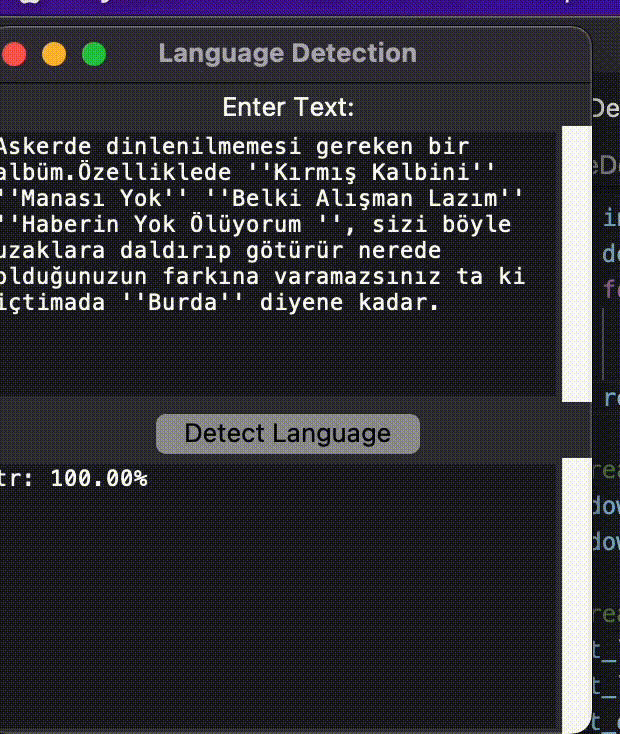

<p align="center">
  
</p>

<h1 align="center">Language Detector</h1>

<p align="center">
  A Python module for natural language processing with language detection functionality and a Tkinter-based Graphical User Interface (GUI).
</p>

<div align="center">

[](LICENSE)
[](https://github.com/onurcangnc/language_detector/issues)
[](https://github.com/onurcangnc/language_detector/pulls)

</div>

## Table of Contents

- [About](#about)
- [Demo](#demo)
- [Features](#features)
- [Getting Started](#getting-started)
- [Usage](#usage)
- [Contributing](#contributing)
- [License](#license)

## About

Welcome to Language Detector, a versatile Python module that simplifies natural language processing tasks. This project offers language detection with high accuracy, and it includes a user-friendly Tkinter-based Graphical User Interface (GUI) for easy interaction. Whether you're a developer or a language enthusiast, this tool will help you identify and analyze languages in text effortlessly.

## Demo


For more visual insight, check out additional [screenshots](demo/) and a live demo on the [demo page](https://your-demo-url.com).

## Features

- **Accurate Language Detection:** Utilize a language detection module with high precision.
- **User-Friendly GUI:** A Tkinter-based GUI makes language detection and analysis straightforward.
- **Extensibility:** Incorporate this module into your projects to enhance text analysis.
- **Easy Integration:** Seamlessly integrate the module into your Python applications.

## Getting Started

To get started with Language Detector, follow these simple steps:

1. Clone the repository:

   ```sh
   $ git clone https://github.com/onurcangnc/language_detector
   $ cd language_detector

2.  Start the GUI:
   
   ```python
   python3 languageDetection.py

## Usage

Once the GUI is running, you can paste or input text into the input field and click the "Detect Language" button to identify the language. 
You can also utilize the module in your Python projects.

## Contributing

We welcome contributions from the community.
If you'd like to improve this project or fix any issues, please check the CONTRIBUTING guidelines.

## License

This project is licensed under the GNU General Public License v3.0. See the LICENSE file for details.